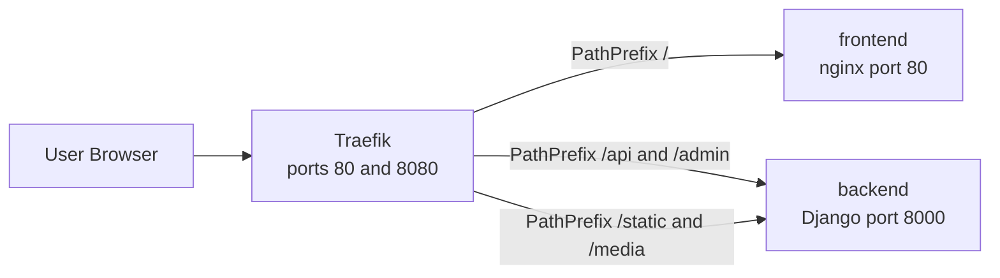
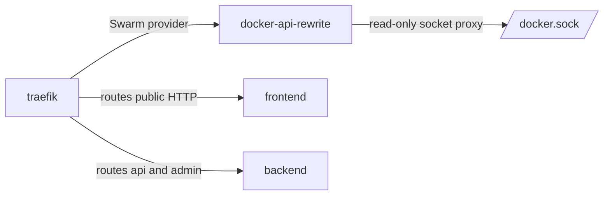
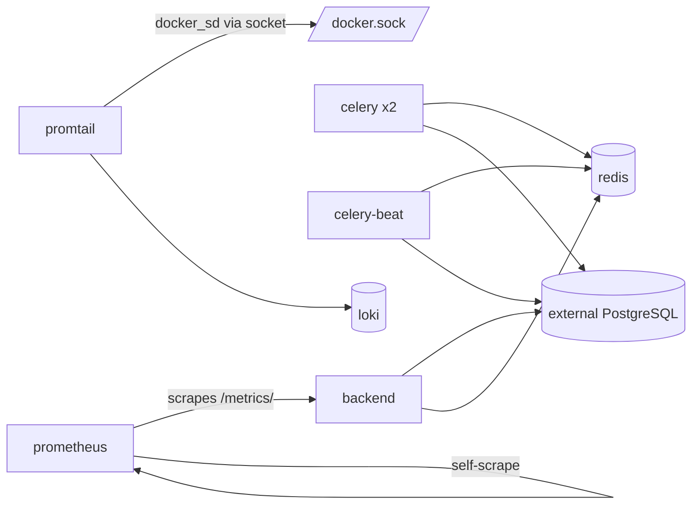
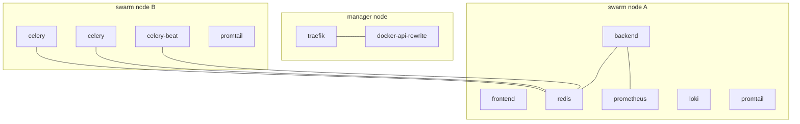

# Docker Swarm Deployment

Compact reference for the production/staging Swarm stack in `deploy/swarm/`.

## What Runs Here

- `docker-api-rewrite`: manager-only nginx proxy in front of the Docker socket.
- `traefik`: ingress and routing, published on host ports `80` and `8080`.
- `frontend`: SPA served on port `80` inside the cluster.
- `backend`: Django API and admin on port `8000`.
- `redis`: cache and Celery broker.
- `celery`: background workers, `2` replicas.
- `celery-beat`: scheduled jobs, `1` replica.
- `prometheus`: metrics collection.
- `loki`: log storage.
- `promtail`: log shipping, global on all nodes.
- External dependencies: PostgreSQL, SMTP, container registry, optional Sentry.

## Networks

- `app`: app-to-app traffic.
- `observability`: metrics and logging traffic.
- `docker_proxy`: Traefik -> docker API rewrite sidecar.

## Request Flow



## Control Plane And Routing



## Internal Service Dependencies



## Swarm Placement



## Secrets And Configs

Secrets expected by `stack.yml`:

- `django_secret_key`
- `postgres_password`
- `email_host_password`
- `sentry_dsn`

Versioned configs created from this directory:

- `traefik_nginx_main`
- `traefik_nginx_proxy`
- `traefik_config`
- `prometheus_config`
- `loki_config`
- `promtail_config`

`STACK_CONFIG_VERSION` is used to generate new config object names during deploys.

## Required Environment

Main variables are shown in `deploy/swarm/swarm.env.example`:

- `REGISTRY_URL`
- `APP_IMAGE_TAG`
- `APP_HOST`
- `APP_HOST_WWW`
- `LETSENCRYPT_EMAIL`
- `POSTGRES_DB`
- `POSTGRES_USER`
- `POSTGRES_HOST`
- `POSTGRES_PORT`
- `EMAIL_HOST`
- `EMAIL_PORT`
- `EMAIL_HOST_USER`
- `DEFAULT_FROM_EMAIL`

## Deploy

```bash
cd deploy/swarm
./validate-stack.sh

docker stack deploy -c stack.yml zdravy
```

## Verify

```bash
docker stack services zdravy
docker service ps zdravy_backend
docker service logs --tail 100 zdravy_backend
```

## Health Checks

- Backend container health: `http://localhost:8000/api/health/`
- Prometheus health: `http://prometheus:9090/-/healthy`
- Traefik is published on host ports `80` and `8080`

## Notes

- `traefik` and `docker-api-rewrite` are pinned to manager nodes.
- `promtail` runs in `global` mode, one task per node.
- `backend`, `celery`, and `celery-beat` join both `app` and `observability` networks.
- Prometheus currently scrapes `backend:8000/metrics/` and itself.
- Traefik uses the Swarm provider through `docker-api-rewrite` with provider network `zdravy_app`.
