# Architektura a dolezite flows

Tato sekcia popisuje, ako spolu komunikuju hlavne casti aplikacie Zdravy Projekt. Je pisana ako orientacna mapa pre vyvoj: kde hladat logiku, kadial tecu data, co je synchronne, co bezia Celery tasky a ktore moduly maju na seba najvacsi dopad.

## Rychly mentalny model

Aplikacia je full-stack system pre objednavanie jedal, spravu klientov, jedalnickov, gramaze, reportov a notifikacii.

- Frontend je React/Vite PWA s oddelenou klientskou a adminskou vetvou.
- Backend je Django + Django REST Framework API.
- PostgreSQL je zdroj pravdy pre pouzivatelov, objednavky, nastavenia, jedalnicky, sviatky a push subscriptions.
- Redis sluzi ako Celery broker/cache a na docasne ulozenie vygenerovanych report suborov.
- Celery worker spracovava reporty, auto-objednavky, denne email reporty a push notifikacie.
- Celery Beat planuje ulohy podla `GlobalSettings`; schedule sa synchronizuje cez Django signals.

## Systemovy diagram

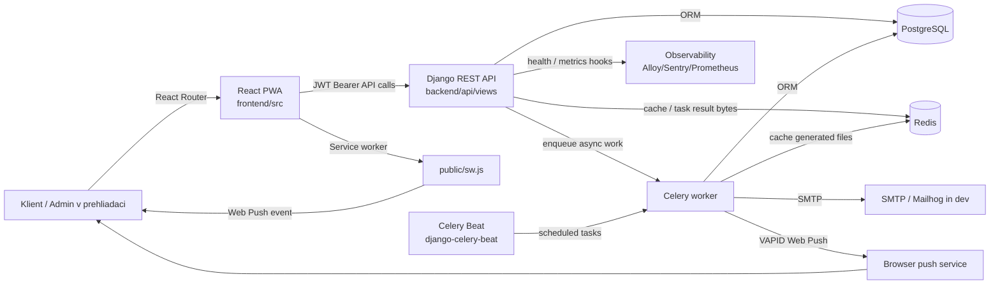

## Runtime a deployment komponenty

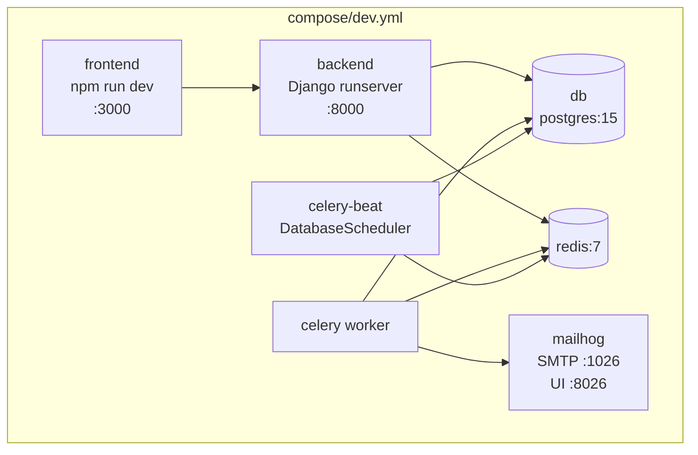

V staging/production compose stackoch frontend/backend bezia ako kontajnery za reverse proxy vrstvou. Development stack navyse seeduje data a inicializuje role pri starte backendu.

## Hlavne moduly

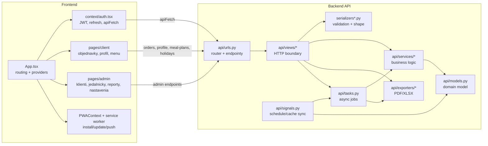

Prakticke pravidlo: HTTP detaily patria do `api/views/*`, tvar dat a validacia do serializerov, domenova logika do `api/services/*`, asynchronna praca do `api/tasks.py`.

## API mapa

| Oblast | Frontend pouziva | Backend endpoint / view | Hlavna logika |
| --- | --- | --- | --- |
| Login a refresh | `LoginPage`, `AuthProvider` | `POST /api/token/`, `POST /api/token/refresh/` | `auth_views.EmailTokenObtainPairSerializer`, SimpleJWT |
| Profil klienta | `AuthProvider.fetchUserProfile`, `ProfilePage` | `/api/user/profile/` | `UserProfileViewSet`, `UserProfileSerializer` |
| Objednavky | `useOrder`, `OrderPage` | `/api/orders/`, `/api/orders/by-date/{date}/` | `DailyOrderViewSet`, `DailyOrderSerializer` |
| Planovane objednavky | `HomePage` / klientsky prehlad | `/api/orders/planned/` | `OrderService.get_planned_orders` |
| Mesacny suhrn | klientsky dashboard | `/api/orders/planned/monthly-summary/` | `OrderService.monthly_summary` |
| Admin klienti | admin UI | `/api/admin/users/` | `AdminUserViewSet`, user/settings/profile modely |
| System settings | `SystemSettings`, klientsky deadline read | `/api/admin/global-settings/` | `GlobalSettingsViewSet`, cache, signals |
| Jedalnicky | `MealPlanCalendar`, `MealPlanEditor`, `MenuPage` | `/api/admin/meal-plans/`, `/api/meal-plans/` | `DailyMealPlanViewSet`, `MealPlanService` |
| Template jedal | admin UI | `/api/admin/meal-templates/` | `MealTemplateViewSet` |
| Typy porcii | klient aj admin | `/api/admin/portion-types/` | `PortionTypeViewSet` |
| Sviatky | klient aj admin | `/api/holidays/`, `/api/admin/holidays/` | `HolidayListViewSet`, `AdminHolidayViewSet` |
| Reporty | admin dashboard | `/api/admin/summary/*` | `AdminSummaryViewSet`, `ReportService`, exporters |
| Async reporty | admin report task UI | `/api/admin/report-tasks/` | `ReportTaskViewSet`, Celery tasks |
| Auto orders | admin manual trigger + Beat | `/api/admin/trigger-auto-orders/` | `apply_auto_orders` |
| Push | PWA + admin UI | `/api/push/*`, `/api/admin/push/send/` | `PushNotificationService`, Celery reminders |

## Domenovy model

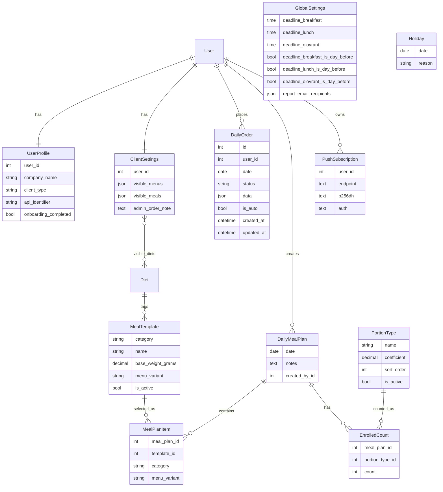

### Dolezite datove tvary

`DailyOrder.data` je JSON a podporuje dve historicke tvary:

- flat: `{"lunch": {"menuCounts": {"A": 5}}}`
- nested by portion category: `{"lunch": {"Dospely": {"menuCounts": {"A": 5}, "diets": {...}}}}`

Backendove agregacie v `OrderService`, `ReportService` a `auto_order_service` s tym pocitaju. Pri novom kode je vhodne drzat nested tvar, pretoze frontend pracuje cez kategorie/typy porcii.

`DailyOrder` ma `unique_together = ["user", "date"]`. Serializer/API preto funguje ako submit alebo replace objednavky pre jeden den. `is_auto=True` oznacuje objednavku vytvorenu po deadline z poslednej ne-prazdnej objednavky.

## Flow: autentifikacia a nacitanie profilu

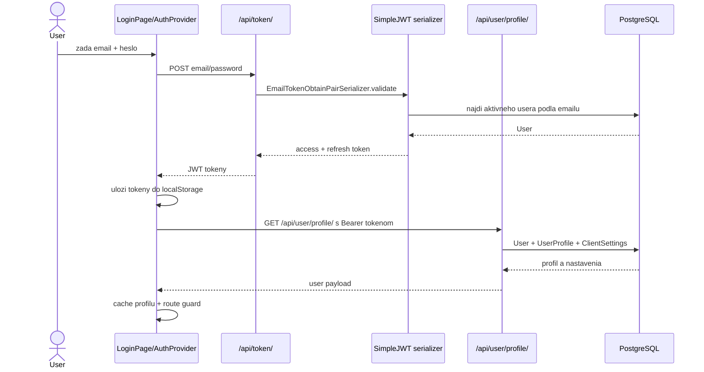

`AuthProvider.apiFetch` pridava Bearer token, synchronizuje offset serveroveho casu z HTTP `Date` headera a pri `401/403` sa pokusi refreshnut access token.

## Flow: klient vytvori objednavku

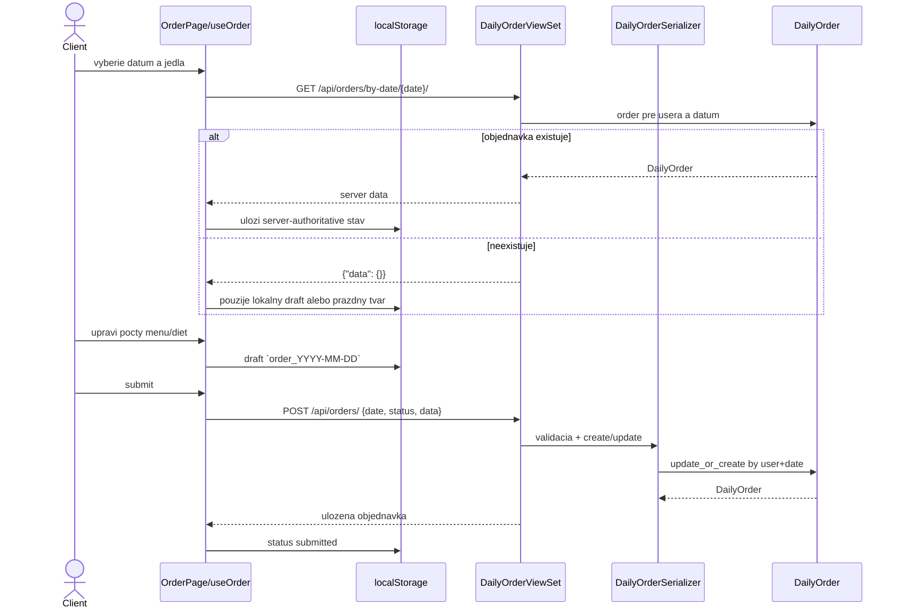

Dolezite pravidla:

- Drafty sa neautosavuju na backend; preziju refresh v `localStorage`.
- Server je autorita po nacitani existujucej objednavky.
- Frontend kontroluje deadline cez `OrderService.checkDeadline` s casom korigovanym podla servera.
- Backend pri `POST /api/orders/` viaze objednavku na aktualneho usera; staff moze tvorit objednavku za klienta cez `user_id`.

## Flow: planovane objednavky a auto-predikcia

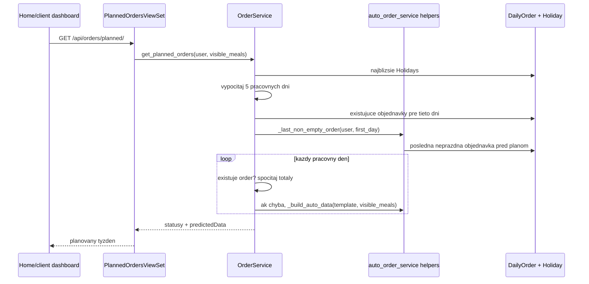

Tento flow je dolezity, lebo pouziva rovnaku predstavu "poslednej neprazdnej objednavky" ako auto-order mechanizmus.

## Flow: Celery auto-orders po deadline

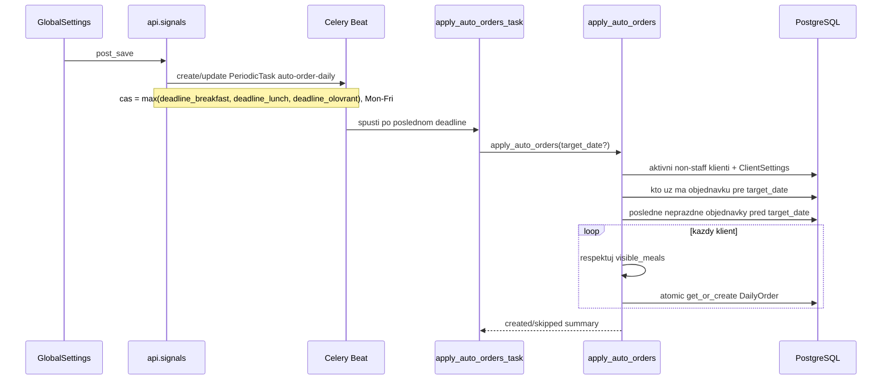

Idempotencia stoji na `unique_together(user, date)`, `transaction.atomic()` a zachyteni `IntegrityError`, takze duplicitne tasky by nemali vytvorit duplicitne objednavky.

## Flow: admin vytvori jedalnicek a gramage report

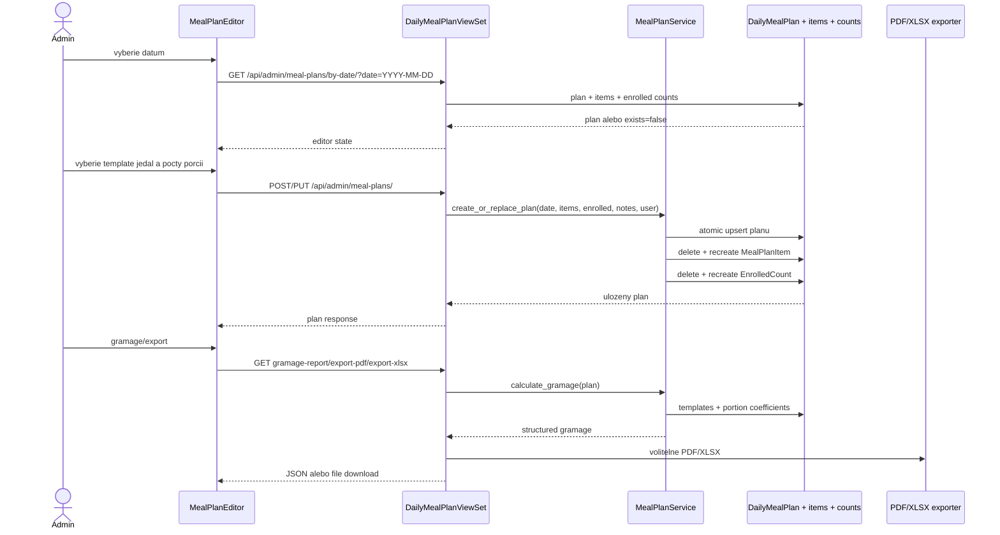

Gramaz sa rata vzorcom:

```text
final_weight = MealTemplate.base_weight_grams * PortionType.coefficient * EnrolledCount.count
```

`MealPlanService.gramage_dashboard` navyse kombinuje objednavky klientov s jedalnickom, menu variantmi, dietami a typmi porcii pre admin dashboard.

## Flow: synchronne a asynchronne reporty

```mermaid
flowchart TB
    AdminUI[Admin dashboard] --> Sync[Sync endpoints<br/>/api/admin/summary/daily-report-pdf<br/>/daily-report-xlsx]
    Sync --> ReportService[ReportService.get_orders_for_export<br/>or direct DailyOrder query]
    ReportService --> Exporters[PDFReportExporter / XLSXReportExporter]
    Exporters --> File[HTTP file response]

    AdminUI --> Async[POST /api/admin/report-tasks/]
    Async --> CeleryTask[generate_report_pdf_task<br/>generate_report_xlsx_task]
    CeleryTask --> Exporters
    CeleryTask --> RedisCache[(Redis cache<br/>report_task:task_id)]
    AdminUI --> Poll[GET /api/admin/report-tasks/{id}/]
    Poll --> CeleryResult[AsyncResult status]
    AdminUI --> Download[GET /api/admin/report-tasks/{id}/download/]
    Download --> RedisCache
    RedisCache --> File2[HTTP file response]
```

Synchronne endpointy su jednoduchsie a vhodne pre mensie reporty. Async report tasky su bezpecnejsie pri vacsich exportoch, pretoze generovanie bezi mimo request threadu a vysledne bytes su docasne ulozene v cache pod klucom konkretneho tasku.

## Flow: denne email reporty

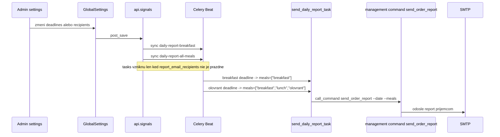

## Flow: push notifikacie

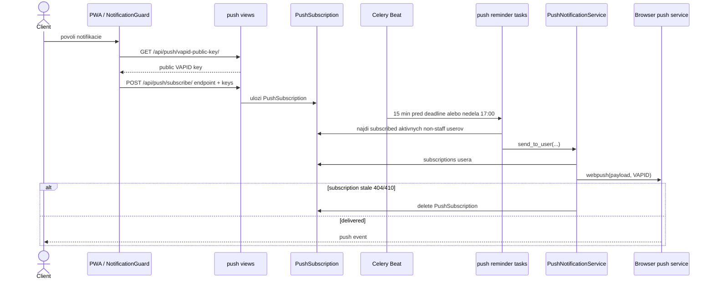

Push reminders sa grupuju podla rovnakeho deadline casu a `is_day_before` flagu, aby pouzivatel nedostal viac duplicitnych notifikacii naraz.

## Komunikacia modulov

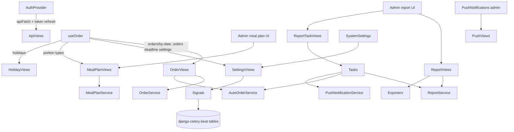

Najdolezitejsie hranice:

- `OrderService` by mal zostat miestom pre objednavkove vypocty, nie komponenty.
- `MealPlanService` je zdroj pravdy pre gramaz a daily meal plan upsert.
- `ReportService` agreguje objednavkove data pre dashboard/reporty.
- `PushNotificationService` izoluje `pywebpush` a mazanie starych subscriptions.
- `signals.py` je infrastruktura pre schedule/cache sync; nema by obsahovat biznis rozhodnutia, ktore patria do service vrstvy.

## Cache, scheduling a invalidacie

```mermaid
flowchart LR
    GlobalSettingsSave[GlobalSettings save] --> ScheduleSync[_sync_auto_order_schedule<br/>_sync_daily_report_schedule<br/>_sync_push_reminder_schedule<br/>_sync_weekly_reminder_schedule]
    ScheduleSync --> BeatTables[(django_celery_beat<br/>PeriodicTask/CrontabSchedule)]
    GlobalSettingsSave --> ClearGlobalCache[clear_global_settings_cache]

    ClientSettingsSave[ClientSettings save] --> DefaultDiets[set default visible_diets<br/>pri novych settings]
    ClientSettingsSave --> ClearClientCache[clear_client_settings_cache(user_id)]

    DietSaveDelete[Diet save/delete] --> ClearDietCache[clear_diet_list_cache]

    DailyStats[Admin daily-stats] --> StatsCache[5 min cache]
    AsyncReports[Async report tasks] --> ReportCache[Redis cache<br/>1 hodina]
```

## Testovacia mapa

Existuju dve vrstvy backend testov:

- `backend/tests/*`: starsie alebo sirsie backend testy pre views, services, security, reports, orders, push, auto-orders.
- `backend/api/tests/*`: strukturovane unit/integration/e2e testy pre API spravanie.

Frontend testy su vo `frontend/src/__tests__` a pri niektorych komponentoch/pages priamo vedla suboru.

Pre zmeny s vyssim rizikom odporucane testy:

| Zmena | Co spustit |
| --- | --- |
| Order submit, planned orders, auto orders | `pytest api/tests/integration/test_order_api.py api/tests/integration/test_auto_orders.py tests/test_auto_orders.py` |
| Deadline alebo settings | `pytest tests/test_orders.py tests/test_startup_sync.py tests/test_push_notifications.py` |
| Reporty/exporty | `pytest tests/test_report_service.py tests/test_report_email.py tests/test_exporters.py api/tests/integration/test_report_async.py` |
| Auth/reset/tokeny | `pytest api/tests/integration/test_auth_api.py tests/test_auth.py tests/test_password_reset.py tests/test_token_refresh.py` |
| Frontend objednavky | `npm test -- OrderService OrderPage` vo `frontend/` |
| Global frontend sanity | `npm run lint && npm run build` vo `frontend/` |

## Miesta so zvysenou pozornostou

- `DailyOrder.data` ma historicky viac tvarov. Pri refaktoringu treba zachovat podporu flat aj nested shape alebo spravit migraciu.
- `GlobalSettings` je singleton-like model. Zmena fields v settings moze ovplyvnit Celery Beat schedules, cache aj frontend deadline logiku.
- `ReportTaskViewSet.download` zavisi od Celery resultu a cache key. Zmena timeoutu alebo backendu cache moze ovplyvnit dostupnost downloadu.
- Auto-orders sa spustaju po najneskorsom deadline. Ak sa prida novy meal type, treba upravit `signals.py`, `tasks.py`, `OrderService`, frontend `OrderService` a report agregacie.
- Frontend `useOrder` pouziva localStorage ako draft vrstvu. Zmeny v datovom tvare objednavky musia riesit migraciu/normalizaciu cez `OrderService.enforceStructure`.
- Push subscriptions su per-device/per-browser. Chybove statusy 404/410 sa mazu automaticky; ine push chyby su iba logovane.

## Kam pridavat novu logiku

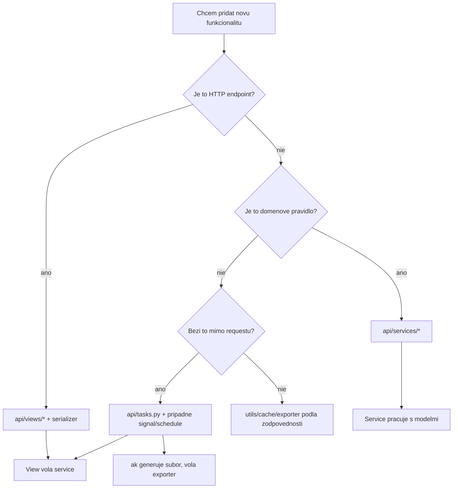

## Zhrnutie architektury

System dava zmysel: ma jasne oddelene frontend routy, backend viewsety, service vrstvy a async ulohy. Najsilnejsie moduly su objednavky, jedalnicky/gramaz, reporty a notifikacie. Najvacsi dopad pri zmenach maju `DailyOrder.data`, `GlobalSettings` deadlines a Celery Beat synchronizacia, pretoze prepajaju frontend, API, background joby a reportovanie.
